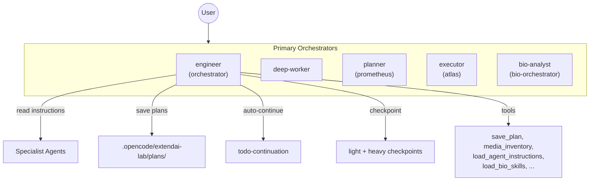

# ExtendAI Lab

> Lightweight Agent Orchestration for [OpenCode](https://github.com/anomalyco/opencode) — 5 orchestrators · 15 specialists · 3-tier prompts · Bioinformatics · Auto-review

[](https://github.com/BOHUYESHAN-APB/openagent-labforge-bio/releases)
[](LICENSE)
[](https://opencode.ai/docs/plugins)
[](https://bun.sh)

<p align="center">
  <b>English</b> · <a href="#中文">中文</a>
</p>

---

## Overview

ExtendAI Lab extends OpenCode with production-grade agent orchestration — 5 primary orchestrators, 15 specialist subagents, a three-tier prompt system, a checkpoint-based memory architecture, main-agent-first cost optimization, and optional bioinformatics domain support.

**The philosophy**: main-agent-first. Most work happens in the primary orchestrator. Subagents are read as instruction checklists (`load_agent_instructions`) rather than spawned as child sessions. This keeps cache hit rates high and token costs low — critical for Chinese providers with token-based pricing.



### vs Base OpenCode

| Feature | Base OpenCode | ExtendAI Lab |
|---------|--------------|--------------|
| Orchestrators | 1 | 5 |
| Subagents | 3 | 15 |
| Prompt System | Fixed | Heavy / Light / Turbo (runtime switch) |
| Auto-Continue | — | Multi-session with structured auto-review |
| Persistent Plans | — | `save_plan` → `/ol-start-work` |
| Subagent Read Tool | — | `load_agent_instructions` |
| Thinking Language | — | Provider-aware (CN→中文, EN→English) |
| Checkpoints | — | Light (same-session) + Heavy (cross-session) |
| Context Pressure | — | L1/L2/L3 monitoring |
| Bioinformatics | — | 442 skills, 3 MCPs |

### Key Numbers

- **1221** tests passing, **101** test files, **0** failures
- **5** primary orchestrators + **15** subagents
- **442** bioinformatics skills, **64** categories
- **14** slash commands, **10** tools

---

## Quick Start

```bash
git clone git@github.com:BOHUYESHAN-APB/openagent-labforge-bio.git
cd openagent-labforge-bio
bun install
bun run build
```

Register in `~/.config/opencode/opencode.json`:

```jsonc
{
  "plugin": ["file:///path/to/openagent-labforge-bio"]
}
```

Restart OpenCode. The plugin loads automatically.

---

## Agent Architecture

### Primary Orchestrators

| Agent | Display | Role |
|-------|---------|------|
| `orchestrator` | engineer | Engineering main agent — coordinates specialists, executes work directly |
| `deep-worker` | deep-worker | Autonomous deep work on complex long-running tasks |
| `prometheus` | planner | Strategic planner — `save_plan` persistence, `detect_bio_task` classification |
| `atlas` | executor | Plan executor — reads saved plans, executes parallel waves |
| `bio-orchestrator` | bio-analyst | Biological science — bioinformatics, experimental design, study strategy |

### Subagents (read-first, spawn-last)

| Agent | Reads | Writes | Special Tools |
|-------|-------|--------|---------------|
| `explorer` | ✅ | — | glob, grep, ast_grep_search |
| `librarian` | — | — | context7, grep_app, websearch |
| `oracle` | ✅ | — | Architecture review, YAGNI |
| `designer` | ✅ | ✅ | UI/UX design & review |
| `fixer` | ✅ | ✅ | Bounded implementation |
| `observer` | ✅ | — | media_inventory, image/PDF analysis |
| `council` | ✅ | — | `council_session` (multi-model consensus) |
| `metis` | ✅ | — | Pre-planning gap analysis |
| `momus` | ✅ | — | Plan review (5-dimension) |
| `multimodal-looker` | ✅ | — | Vision-capable media interpretation |
| `reviewer` | ✅ | — | Code review (Correctness, Security, Performance, Style) |

### Subagent Policy

| Mode | Default? | Behavior |
|------|----------|----------|
| `ultra-minimal` | ✅ Yes | Only explorer, librarian, oracle registered. Others are local checklists |
| `minimal` | — | + fixer, observer |
| `full` | — | All agents registered; main-agent-first remains default |
| `custom` | — | `allowedAgents` allowlist |
| `main-only` | — | No child sessions, all specialist guidance as local checklists |

Switch: `/ol-subagents-UM` `/ol-subagents-M` `/ol-subagents-F` `/ol-subagents-C` `/ol-subagents-MO`

---

## Core Features

### 1. Plan Persistence

All 3 primary orchestrators (engineer, bio-analyst, chem-analyst) can persist plans:

```
User: "Plan this feature"
  → Planner analyzes → detect_bio_task → load_bio_skills (if bio)
  → save_plan("my-plan", content)
  → Saved: .opencode/extendai-lab/plans/my-plan.md
  → "Next: /ol-start-work my-plan"

User: /ol-start-work my-plan
  → Executor loads plan → executes parallel waves → auto-continue
```

### 2. Auto-Continue & Auto-Review

```
todowrite → auto_continue(enabled=true)
  → session goes idle → check for incomplete todos
  → inject continuation prompt → agent resumes
  → all todos complete → inject REVIEW_PROMPT
  → [APPROVE] batch done · [REJECT] rework · [NEEDS_USER] pause · [BLOCKED] pause
```

- Auto-continue: max 5 consecutive, configurable cooldown
- Auto-review: structured check against original request
- User intent detection: "thanks", "嗯好" → auto-stop when todos complete

### 3. Load Agent Instructions

```typescript
load_agent_instructions({ agent: 'explorer' })  // returns full explorer prompt
load_agent_instructions({ agent: 'oracle' })    // returns full oracle prompt
```

Main agent reads specialist prompts, understands their workflow, then **does the work itself** — no child session needed. Improves cache hit rate.

### 4. Thinking Language

| Provider | Thinking Language | Why |
|----------|------------------|-----|
| DeepSeek • GLM • Kimi • Mimo • Qwen • Doubao • MiniMax | 🇨🇳 中文 | Chinese tokens cheaper |
| Claude • GPT • Gemini • Grok • Mistral | 🇬🇧 English | English tokens cheaper |

### 5. Three-Tier Prompts

| Mode | Use |
|------|-----|
| Light (default) | Daily development |
| Heavy | Complex multi-step tasks |
| Turbo | Fast execution, minimal overhead |

Switch: `/ol-light` `/ol-heavy` `/ol-turbo`

### 6. Checkpoints

| Type | Trigger | Use |
|------|---------|-----|
| Light | L2 (60-75% context) | Same-session recovery |
| Heavy | L3 (>75% context) | Cross-session handoff |

115+ metadata fields for heavy checkpoints — full state reconstruction.

---

## Configuration

`~/.config/opencode/extendai-lab.jsonc` or `.opencode/extendai-lab.jsonc`:

```jsonc
{
  "promptMode": { "defaultMode": "light", "allowModeSwitch": true },
  "bioSkills": { "enabled": true },
  "modelPreferences": { "profile": "openai" },
  "subagentPolicy": { "mode": "ultra-minimal" },
  "compression": {
    "enabled": true,
    "profiles": {
      "engineering": { "l1": 0.5, "l2": 0.65, "l3": 0.8 },
      "bio": { "l1": 0.55, "l2": 0.7, "l3": 0.85 }
    }
  }
}
```

See [`extendai-lab.example.jsonc`](extendai-lab.example.jsonc) for full reference.

---

## Commands

| Command | Mode | Description |
|---------|------|-------------|
| `/ol-light` / `/ol-heavy` / `/ol-turbo` | Prompt | Switch prompt mode |
| `/ol-checkpoint-light [goal]` | Checkpoint | Light checkpoint (same-session) |
| `/ol-checkpoint-heavy [goal]` | Checkpoint | Heavy checkpoint (cross-session) |
| `/ol-start-work [name]` | Workflow | Execute a saved plan |
| `/ol-auto-continue-on/off` | Continuation | Toggle auto-continuation |
| `/ol-subagents-UM/M/F/C/MO` | Policy | View subagent policy guidance |
| `/ol-preset [name]` | Config | Switch model/provider preset |
| `/ol-karpathy [task]` | Guidance | Apply Karpathy coding guidelines |

---

## Bioinformatics

**442 skills across 64 categories**, loaded on-demand:

```typescript
load_bio_skills({ categories: ["rna-seq"] })  // RNA sequencing skills
load_bio_skills({ categories: ["chip-seq"] })  // ChIP-seq analysis
```

Built-in MCPs: UniProt (proteins), BioNext (multi-omics), Semantic Scholar (papers)

---

## Development

```bash
bun run build      # Build plugin + CLI + schema
bun run typecheck  # TypeScript type checking
bun test           # 1221 tests, 101 files
bun run check:ci   # Lint + format + organize imports
```

---

## Cost Optimization (for Chinese Users)

**Why this matters**: Chinese providers (DeepSeek, Qwen, Kimi, etc.) bill per token with a strong cache-hit multiplier. Every new child session starts with 0% cache hit, doubling the effective cost.

| Strategy | Cache Hit |
|----------|-----------|
| Ultra-minimal default (3 subagents only) | 98%+ |
| `load_agent_instructions` (read, don't spawn) | 95-100% |
| Shared prefix snapshot (all children share same prefix) | 60-80% |
| Thinking language (CN model → Chinese, EN model → English) | Variable |

**Rule of thumb**: don't spawn a subagent if you can do the work yourself in the main agent. Use `load_agent_instructions` to read their prompts first.

---

## 中文

**ExtendAI Lab** 是 OpenCode 的 Agent 编排插件 — 5 个主编排器、15 个专有子代理、自动续跑与审查、计划持久化、三层提示词、以及面向国内模型的成本优化策略。

### 快速开始

```bash
git clone git@github.com:BOHUYESHAN-APB/openagent-labforge-bio.git --depth=1
cd openagent-labforge-bio && bun install && bun run build
```

在 `~/.config/opencode/opencode.json` 注册插件后重启即可。

### 核心能力

| 能力 | 实现方式 |
|------|---------|
| **主代理优先** | 默认 ultra-minimal 模式，只注册 3 个子代理，其余为本地 checklist |
| **自动续跑** | `todowrite` + `auto_continue`，任务未完成自动继续，完成后自动审查 |
| **计划持久化** | `save_plan` 写入 `.opencode/extendai-lab/plans/`，`/ol-start-work` 恢复执行 |
| **子代理提示词读取** | `load_agent_instructions` 工具，主代理读懂子代理能力后自行执行 |
| **思考语言优化** | 国模 (DeepSeek/Qwen/Kimi/GLM/Mimo/Doubao) → 中文思考；海外模型 → 英文思考 |
| **上下文压力** | L1/L2/L3 三级监测，自动触发 checkpoint |
| **检查点系统** | 轻量（同会话恢复）+ 重量（跨会话交接），115+ 元数据字段 |
| **生物信息学** | 442 个领域技能（64 大类）+ UniProt/BioNext/Semantic Scholar MCP |

### 成本优化要点

国内模型 token 套餐下，**缓存命中率直接影响成本**。核心策略：主代理优先执行，子代理提示词读取而非启动新会话，共享前缀对齐。详见上方 English 部分的 Cost Optimization 节。

---

## License & Credits

[Apache-2.0](LICENSE)

- **Base**: [oh-my-opencode-slim](https://github.com/alvinunreal/oh-my-opencode-slim) (MIT) — forked and extended
- **Patterns from**: [oh-my-openagent](https://github.com/code-yeongyu/oh-my-openagent), [oh-my-codex](https://github.com/Yeachan-Heo/oh-my-codex), [hermes-agent](https://github.com/NickTomlin/hermes-agent)
- **Turbo prompt inspired by**: [opencode-workspace](https://github.com/kdcokenny/opencode-workspace) (MIT)
