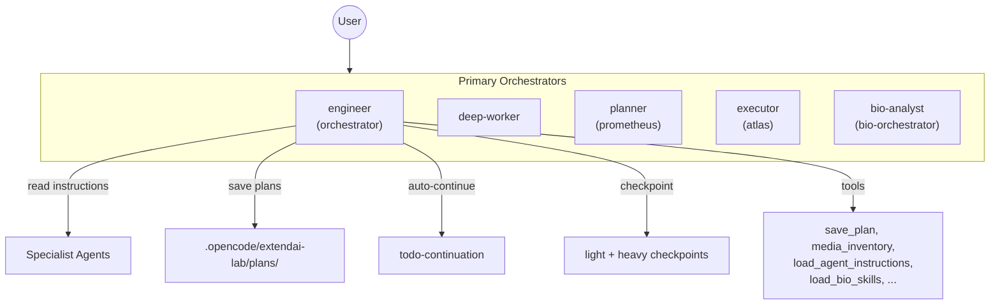

# ExtendAI Lab

> Lightweight Agent Orchestration for [OpenCode](https://github.com/anomalyco/opencode) — 5 orchestrators · 15 specialists · 3-tier prompts · Bioinformatics · Academic Paper Mode · Auto-review

[](https://github.com/BOHUYESHAN-APB/openagent-labforge-bio/releases)
[](LICENSE)
[](https://opencode.ai/docs/plugins)
[](https://bun.sh)

<p align="center">
  <b>English</b> · <a href="#中文">中文</a>
</p>

---

## Overview

ExtendAI Lab extends OpenCode with production-grade agent orchestration — 5 primary orchestrators, 15 specialist subagents, a three-tier prompt system, a checkpoint-based memory architecture, main-agent-first cost optimization, and optional bioinformatics domain support.

**The philosophy**: main-agent-first. Most work happens in the primary orchestrator. Subagents are read as instruction checklists (`load_agent_instructions`) rather than spawned as child sessions. This keeps cache hit rates high and token costs low — critical for Chinese providers with token-based pricing.



### vs Base OpenCode

| Feature | Base OpenCode | ExtendAI Lab |
|---------|--------------|--------------|
| Orchestrators | 1 | 5 |
| Subagents | 3 | 15 |
| Prompt System | Fixed | Heavy / Light / Turbo (runtime switch) |
| Auto-Continue | — | Multi-session with structured auto-review |
| Persistent Plans | — | `save_plan` → `/ol-start-work` |
| Subagent Read Tool | — | `load_agent_instructions` |
| Thinking Language | — | Provider-aware (CN→中文, EN→English) |
| Checkpoints | — | Light (same-session) + Heavy (cross-session) |
| Context Pressure | — | L1/L2/L3 monitoring |
| Bioinformatics | — | 442 skills, 3 MCPs |

### Key Numbers

- **1221** tests passing, **101** test files, **0** failures
- **5** primary orchestrators + **15** subagents
- **442** bioinformatics skills, **64** categories
- **14** slash commands, **10** tools

---

## Quick Start

### AI Agent Installation

If you're an AI coding agent reading this, fetch and follow the installation instructions:

```bash
curl -s https://raw.githubusercontent.com/BOHUYESHAN-APB/openagent-labforge-bio/master/docs/installation.md
```

### Manual Installation (git clone)

```bash
git clone git@github.com:BOHUYESHAN-APB/openagent-labforge-bio.git
cd openagent-labforge-bio
bun install
bun run build
```

Register in `~/.config/opencode/opencode.json`:

```jsonc
{
  "plugin": ["file:///path/to/openagent-labforge-bio"]
}
```

Restart OpenCode. The plugin loads automatically.

---

## Agent Architecture

### Primary Orchestrators

| Agent | Display | Role |
|-------|---------|------|
| `orchestrator` | engineer | Engineering main agent — coordinates specialists, executes work directly |
| `deep-worker` | deep-worker | Autonomous deep work on complex long-running tasks |
| `prometheus` | planner | Strategic planner — `save_plan` persistence, `detect_bio_task` classification |
| `atlas` | executor | Plan executor — reads saved plans, executes parallel waves |
| `bio-orchestrator` | bio-analyst | Biological science — bioinformatics, experimental design, study strategy |

### Subagents (read-first, spawn-last)

| Agent | Reads | Writes | Special Tools |
|-------|-------|--------|---------------|
| `explorer` | ✅ | — | glob, grep, ast_grep_search |
| `librarian` | — | — | context7, grep_app, websearch |
| `oracle` | ✅ | — | Architecture review, YAGNI |
| `designer` | ✅ | ✅ | UI/UX design & review |
| `fixer` | ✅ | ✅ | Bounded implementation |
| `observer` | ✅ | — | media_inventory, image/PDF analysis |
| `council` | ✅ | — | `council_session` (multi-model consensus) |
| `metis` | ✅ | — | Pre-planning gap analysis |
| `momus` | ✅ | — | Plan review (5-dimension) |
| `multimodal-looker` | ✅ | — | Vision-capable media interpretation |
| `reviewer` | ✅ | — | Code review (Correctness, Security, Performance, Style) |

### Subagent Policy

| Mode | Default? | Behavior |
|------|----------|----------|
| `ultra-minimal` | ✅ Yes | Only explorer, librarian, oracle registered. Others are local checklists |
| `minimal` | — | + fixer, observer |
| `full` | — | All agents registered; main-agent-first remains default |
| `custom` | — | `allowedAgents` allowlist |
| `main-only` | — | No child sessions, all specialist guidance as local checklists |

Switch: `/ol-subagents-UM` `/ol-subagents-M` `/ol-subagents-F` `/ol-subagents-C` `/ol-subagents-MO`

---

## Core Features

### 1. Plan Persistence

All 3 primary orchestrators (engineer, bio-analyst, chem-analyst) can persist plans:

```
User: "Plan this feature"
  → Planner analyzes → detect_bio_task → load_bio_skills (if bio)
  → save_plan("my-plan", content)
  → Saved: .opencode/extendai-lab/plans/my-plan.md
  → "Next: /ol-start-work my-plan"

User: /ol-start-work my-plan
  → Executor loads plan → executes parallel waves → auto-continue
```

### 2. Auto-Continue & Auto-Review

```
todowrite → auto_continue(enabled=true)
  → session goes idle → check for incomplete todos
  → inject continuation prompt → agent resumes
  → all todos complete → inject REVIEW_PROMPT
  → [APPROVE] batch done · [REJECT] rework · [NEEDS_USER] pause · [BLOCKED] pause
```

- Auto-continue: max 5 consecutive, configurable cooldown
- Auto-review: structured check against original request
- User intent detection: "thanks", "嗯好" → auto-stop when todos complete

### 3. Load Agent Instructions

```typescript
load_agent_instructions({ agent: 'explorer' })  // returns full explorer prompt
load_agent_instructions({ agent: 'oracle' })    // returns full oracle prompt
```

Main agent reads specialist prompts, understands their workflow, then **does the work itself** — no child session needed. Improves cache hit rate.

### 4. Thinking Language

| Provider | Thinking Language | Why |
|----------|------------------|-----|
| DeepSeek • GLM • Kimi • Mimo • Qwen • Doubao • MiniMax | 🇨🇳 中文 | Chinese tokens cheaper |
| Claude • GPT • Gemini • Grok • Mistral | 🇬🇧 English | English tokens cheaper |

### 5. Three-Tier Prompts

| Mode | Use |
|------|-----|
| Light (default) | Daily development |
| Heavy | Complex multi-step tasks |
| Turbo | Fast execution, minimal overhead |

Switch: `/ol-light` `/ol-heavy` `/ol-turbo`

### 6. Checkpoints

| Type | Trigger | Use |
|------|---------|-----|
| Light | L2 (60-75% context) | Same-session recovery |
| Heavy | L3 (>75% context) | Cross-session handoff |

115+ metadata fields for heavy checkpoints — full state reconstruction.

### 7. Model Presets

Five preset modes. **Default is `free`** — no model binding, no recommendations, no interference. You control which model each agent uses.

| Command | Preset | Description |
|---------|--------|-------------|
| `/ol-preset-free` | `free` | No binding — use current OpenCode model (default) |
| `/ol-preset-ds-first` | `ds-first` | DS V4 Pro main, Flash workers, MiMo vision — OpenCode Go $10/mo |
| `/ol-preset-openai` | `openai` | GPT-5.4 daily, 5.5 for reviews only — ChatGPT Plus/Pro |
| `/ol-preset-openai-go` | `openai-go` | Dual sub: GPT review + DS workers — best of both |
| `/ol-preset-custom` | `custom` | Per-agent model + variant from `extendai-lab.jsonc` |

**Per-agent strategy** (ds-first example):

| Role | Model | Reasoning |
|------|-------|-----------|
| Orchestrator, bio, deep-worker | DS V4 Pro `max` | Main workhorse |
| Oracle, reviewer, council | DS V4 Pro `high` | Spend on quality reviews |
| Explorer, librarian, fixer | DS V4 Flash `high` | Fast & cheap bulk work |
| Designer, observer, mm-looker | MiMo V2.5 `medium` | 1M context + vision |

Each agent gets an independent reasoning effort (`variant`): `low` / `medium` / `high` / `xhigh` / `max`.

---

## Configuration

`~/.config/opencode/extendai-lab.jsonc` or `.opencode/extendai-lab.jsonc`:

```jsonc
{
  "promptMode": { "defaultMode": "light", "allowModeSwitch": true },
  "bioSkills": { "enabled": true },
  "modelPreferences": { "profile": "openai" },
  "subagentPolicy": { "mode": "ultra-minimal" },
  "compression": {
    "enabled": true,
    "profiles": {
      "engineering": { "l1": 0.5, "l2": 0.65, "l3": 0.8 },
      "bio": { "l1": 0.55, "l2": 0.7, "l3": 0.85 }
    }
  }
}
```

See [`extendai-lab.example.jsonc`](extendai-lab.example.jsonc) for full reference.

---

## Commands

| Command | Mode | Description |
|---------|------|-------------|
| `/ol-light` / `/ol-heavy` / `/ol-turbo` | Prompt | Switch prompt mode |
| `/ol-checkpoint-light [goal]` | Checkpoint | Light checkpoint (same-session) |
| `/ol-checkpoint-heavy [goal]` | Checkpoint | Heavy checkpoint (cross-session) |
| `/ol-start-work [name]` | Workflow | Execute a saved plan |
| `/ol-auto-continue-on/off` | Continuation | Toggle auto-continuation |
| `/ol-subagents-UM/M/F/C/MO` | Policy | View subagent policy guidance |
| `/ol-preset [name]` | Config | Switch model/provider preset |
| `/ol-karpathy [task]` | Guidance | Apply Karpathy coding guidelines |

---

## Bioinformatics

**442 skills across 64 categories**, loaded on-demand:

```typescript
load_bio_skills({ categories: ["rna-seq"] })  // RNA sequencing skills
load_bio_skills({ categories: ["chip-seq"] })  // ChIP-seq analysis
```

Built-in MCPs: UniProt (proteins), BioNext (multi-omics), Semantic Scholar (papers)

---

## Academic Writing

Literature management, citation validation, and Chinese academic formatting (GB/T 7714-2015).

### Features

- **Literature management** — Papis CLI integration for paper organization
- **Citation validation** — Check citations against bibliography
- **MD → HTML → DOCX pipeline** — Avoids Markdown syntax leakage in final documents
- **Chinese academic formatting** — GB/T 7714-2015 standards (SimSun/Times New Roman/SimHei fonts, proper sizing)
- **Environment-aware tool checking** — Windows/WSL/Linux/macOS support

### Setup

Check tools (on-demand, only when writing):

```typescript
academic_check_tools()
```

Install missing tools:

```bash
pip install papis                    # Literature management
pip install python-docx beautifulsoup4 lxml  # DOCX generation
# Pandoc: https://pandoc.org/installing.html
```

### Workflow

1. **Add papers**:
   ```bash
   papis add paper.pdf --from doi 10.1234/example
   papis add --from arxiv 2301.12345
   ```

2. **Write in Markdown**: `manuscripts/paper.md`
   ```markdown
   # Paper Title
   
   ## Introduction
   
   Previous work [@smith2020] has shown...
   ```

3. **Export bibliography**:
   ```bash
   papis export --all --format bibtex > manuscripts/paper.bib
   ```

4. **Generate DOCX**:
   ```typescript
   academic_build_docx({
     manuscriptPath: "manuscripts/paper.md",
     options: {
       fontCn: "SimSun",      // 宋体
       fontEn: "Times New Roman",
       fontHeading: "SimHei",  // 黑体
       lineSpacing: 1.5
     }
   })
   ```

Output: `manuscripts/paper.docx` with proper Chinese/English font separation, GB/T 7714-2015 formatting, and processed citations.

**Skill**: Load `academic-writing` skill for detailed workflows and troubleshooting.

---

## Development

```bash
bun run build      # Build plugin + CLI + schema
bun run typecheck  # TypeScript type checking
bun test           # 1221 tests, 101 files
bun run check:ci   # Lint + format + organize imports
```

---

## Cost Optimization (for Chinese Users)

**Why this matters**: Chinese providers (DeepSeek, Qwen, Kimi, etc.) bill per token with a strong cache-hit multiplier. Every new child session starts with 0% cache hit, doubling the effective cost.

| Strategy | Cache Hit |
|----------|-----------|
| Ultra-minimal default (3 subagents only) | 98%+ |
| `load_agent_instructions` (read, don't spawn) | 95-100% |
| Shared prefix snapshot (all children share same prefix) | 60-80% |
| Thinking language (CN model → Chinese, EN model → English) | Variable |

**Rule of thumb**: don't spawn a subagent if you can do the work yourself in the main agent. Use `load_agent_instructions` to read their prompts first.

---

## 中文文档

完整中文文档请阅读 **[README.zh-CN.md](README.zh-CN.md)**。

---

## Changelog

### v1.1.0 (2026-05-20)

**Paper Mode & Path Resolution Fix**

#### Breaking Changes
- Removed MCP shared-server logic — each OpenCode window now runs an independent MCP server instance
- This fixes multi-window MCP connection failures but means each window has its own server process

#### Core Fixes
- **Plugin Path Resolution**: Fixed build-time `__dirname` hardcoding — paths now resolve via
  `getPackageRoot(import.meta.url)` at runtime, enabling built-in skill discovery when installed
  from npm on any machine.
- **Bio Skills Catalog**: Replaced hardcoded routing guide with auto-generated entries from catalog.json.
  Removed absolute file path exposure from loaded skills prompt to prevent AI from copying files.
- **Auto-Review System**: Refactored to support both main-agent self-review (Option A) and
  @oracle delegation (Option B)
- **save_plan Tool**: Enhanced description to explicitly prevent AI from outputting plans to conversation
- **Start Work Command**: Improved cross-window state recovery with explicit context section
- **Delete Guard**: Expanded tool name matching (bash, shell, exec, execute_command, powershell, etc.)

#### New Features
- **Academic Paper Mode Skills**: New `resources/academicSkills/` category system with:
  - `academic-cnki-parser` — Parse CNKI export files (`.txt`, `.net`, `.enw`, `.ris`, `.bib`)
    into unified BibTeX, auto-detect format, merge multi-file exports
  - `academic-cite-match` — Match `[[cite:keywords]]` markers in body text to bibliography
    entries, multi-layer matching (keyword → TF-IDF → semantic)
  - `academic-md2docx` — Markdown → HTML → DOCX pipeline with Chinese academic formatting
    (SimSun/SimHei/Times New Roman proper sizing)
  - MIT-licensed upstream skills integrated: research-writing, office-academic, scientific-toolkit
- **`THIRD_PARTY_NOTICES.md`**: Extended with full provenance tracking for all integrated
  third-party skills and AI-assisted content

#### Known Issues Resolved
- ✅ Plugin Skill Path Resolution (build-time `__dirname` hardcoding — fixed)
- ✅ MCP Multi-Window Sharing (removed shared logic)
- ✅ Delete Command Guard (expanded tool matching)
- ✅ Plan Mode Prompt Overhead (optimized save_plan description)
- ⚠️ Start Work Command Detection (improved but may need further testing)

---

## Future Enhancements (v2.1.0+)

### Context Management (High Priority)

**Problem**: Current session context can reach 140K tokens, approaching the 500K danger threshold where context errors begin.

**Planned Solutions**:

1. **Auto Checkpoint Light** (v2.1.0)
   - Automatically generate checkpoint light every 54-60 LLM calls
   - Proactively move infrequently-used context to checkpoint storage
   - Reduce main context size to stay well below 500K threshold
   - Trade-off: Lower cache hit rate vs. avoiding context corruption

2. **Context Layering** (v2.2.0)
   - Frequently-used context: Keep in main session
   - Infrequently-used context: Store in checkpoint, restore on-demand
   - Smart eviction policy based on access patterns
   - Automatic context pressure monitoring and warnings

3. **Cross-Session State Management** (v2.2.0)
   - Enhanced boulder.json state persistence
   - Better new-window context initialization
   - Checkpoint-based session resumption
   - Reduced reliance on prompt injection for state recovery

### Other Planned Features

- **Citation Validation** (v2.1.0): Real-time citation checking against bibliography
- **Dashboard Enhancements** (v2.2.0): Real-time context pressure visualization, checkpoint history
- **Bio Skills Expansion** (v2.3.0): Additional bioinformatics workflows and tool integrations
- **Academic Skills Expansion**: More paper-mode writing assistants, automated reference matching

---

## Known Issues

### Plan File Write Permissions
- **Issue**: AI cannot proactively write plan files to `.opencode/extendai-lab/plans/`.
- **Root cause**: Possible permission issue or tool limitation.
- **Workaround**: Manually create plan files or use `save_plan` tool when available.
- **Status**: Under investigation.

### Context Pressure (500K Threshold)
- **Issue**: Current session context can reach ~140K tokens, approaching the 500K danger threshold where context errors begin.
- **Root cause**: Long-running sessions accumulate context without automatic cleanup.
- **Impact**: Context corruption, hallucinations, and incorrect responses when approaching 500K tokens.
- **Workaround**: Use checkpoint commands to save state and start fresh sessions periodically.
- **Status**: Auto checkpoint light planned for v2.1.0 (see Future Enhancements).

---

## License & Credits

[Apache-2.0](LICENSE)

- **Base**: [oh-my-opencode-slim](https://github.com/alvinunreal/oh-my-opencode-slim) (MIT) — forked and extended
- **Patterns from**: [oh-my-openagent](https://github.com/code-yeongyu/oh-my-openagent), [oh-my-codex](https://github.com/Yeachan-Heo/oh-my-codex), [hermes-agent](https://github.com/NickTomlin/hermes-agent)
- **Turbo prompt inspired by**: [opencode-workspace](https://github.com/kdcokenny/opencode-workspace) (MIT)
