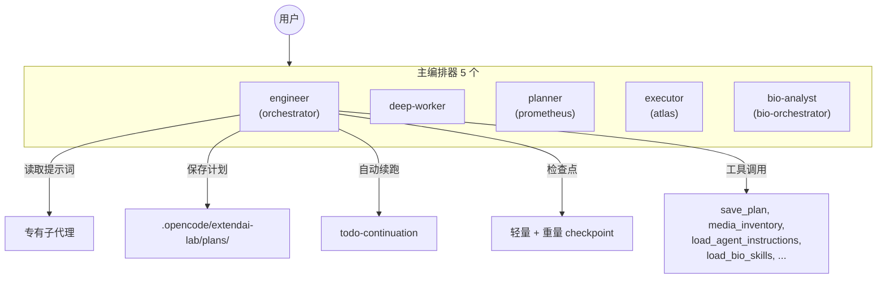

# ExtendAI Lab

> OpenCode 的生产级 Agent 编排系统 — 5 个主编排器 · 15 个专有子代理 · 三层提示词 · 自动续跑与审查 · 生物信息学 · 成本优化

[](https://github.com/BOHUYESHAN-APB/openagent-labforge-bio/releases)
[](LICENSE)
[](https://opencode.ai/docs/plugins)
[](https://bun.sh)

<p align="center">
  <a href="README.md">English</a> · <b>中文</b>
</p>

---

## 概述

ExtendAI Lab 是 OpenCode 的轻量级 Agent 编排插件，在原生 OpenCode 基础上大幅扩展了代理体系、工作流自动化、领域知识库和成本优化策略。

**核心哲学**："主代理优先"（main-agent-first）。绝大多数工作在主代理中完成。子代理不作为独立会话启动，而是通过 `load_agent_instructions` 工具读取其提示词和工作流程，由主代理自行执行。这一策略在基于 token 计费的国内模型中至关重要——每一轮新会话都从零命中率开始，成本翻倍。



### 与原生 OpenCode 的核心差异

| 功能 | 原生 OpenCode | ExtendAI Lab |
|------|-------------|--------------|
| 主编排器数量 | 1 | 5（工程/深度/规划/执行/生物） |
| 子代理数量 | 3 | 15 |
| 提示词系统 | 固定 | 三级可切换（Light / Heavy / Turbo） |
| 自动续跑 | — | 多会话续跑 + 结构化自动审查 |
| 持久化计划 | — | `save_plan` → `/ol-start-work` 工作流 |
| 子代理提示词读取 | — | `load_agent_instructions` 返回完整提示词 |
| 思考语言优化 | — | 国模→中文，海外→英文 |
| 检查点系统 | — | 轻量（同会话）+ 重量（跨会话） |
| 上下文压力监测 | — | L1/L2/L3 三级自动响应 |
| 生物信息学 | — | 617 个领域技能，88 大类，3 个 MCP |

### 关键数据

- **1221** 个测试通过，**101** 个测试文件，**0** 失败
- **5** 个主编排器 + **15** 个子代理
- **617** 个生物信息学技能，**88** 个类别
- **14** 个斜杠命令，**10** 个自定义工具

### 推荐配套工具

| 工具 | 用途 | 安装方式 |
|------|------|---------|
| [**OfficeCLI**](https://github.com/iOfficeAI/OfficeCLI) | AI 原生 Word/Excel/PowerPoint CLI — 创建、读取、修改 `.docx`/`.xlsx`/`.pptx`，无需安装 Office | `curl -fsSL https://raw.githubusercontent.com/iOfficeAI/OfficeCLI/main/install.sh \| bash`（macOS/Linux）或 `irm https://raw.githubusercontent.com/iOfficeAI/OfficeCLI/main/install.ps1 \| iex`（Windows） |

**为什么推荐 OfficeCLI？** 我们的学术技能处理论文写作管线，但 OfficeCLI 提供**标准化、安全的** Office 文档操作，适用于任何场景——报告、演示文稿、数据表、模板。单一可执行文件，零依赖，AI 可自动检测并建议安装。

### 免责声明

**我们无法保证 AI 生成内容的准确性。**

本插件面向学术和研究工作流。虽然我们构建了完整的工作流体系——包括学术诚信规则、引用验证、来源核实和结构化审查流程——但 AI 生成的内容（文本、代码、数据、引用、分析）可能存在错误、不准确或捏造的信息，且这些信息无法被人类快速辨别真伪。

**我们的缓解措施：**
- 在 agent 提示词层面强制执行学术诚信规则
- 引用验证和来源核实工作流
- 多重检查点的结构化审查流程
- 明确指示禁止捏造数据、DOI 或实验结果
- 对近期学术诚信事件频发的领域（如生物学）保持特别警惕

**我们无法做到的：**
- 保证 AI 生成内容无错误
- 验证所有引用来源的真实性
- 检测所有形式的学术不端行为
- 取代人类对研究质量的判断

**用户的责任：**
- 使用前验证所有 AI 生成内容
- 独立核实引用的来源和参考文献
- 对所有输出保持批判性判断
- 遵守所在机构的学术诚信政策

---

## 快速开始

```bash
git clone git@github.com:BOHUYESHAN-APB/openagent-labforge-bio.git --depth=1
cd openagent-labforge-bio
bun install
bun run build
```

在 `~/.config/opencode/opencode.json` 中注册插件：

```jsonc
{
  "plugin": ["file:///home/user/openagent-labforge-bio"]
}
```

重启 OpenCode 即可。无需额外配置。

> Windows 用户使用 `file:///D:/path/to/openagent-labforge-bio` 格式。
> 国内用户如 GitHub 访问慢，可加 `--depth=1` 浅克隆。

---

## 代理架构

### 主编排器（OpenCode UI 可见）

| Agent 名 | 显示名 | 角色与职责 |
|-----------|--------|-----------|
| `orchestrator` | engineer | **工程主代理** — 协调所有子代理，执行大部分工作。默认编排器 |
| `deep-worker` | deep-worker | **深度工作者** — 处理复杂、长时间运行的任务，自主决策 |
| `prometheus` | planner | **战略规划师** — `save_plan` 持久化、`detect_bio_task` 分类、多阶段规划 |
| `atlas` | executor | **计划执行器** — 读取已保存的计划，执行并行任务波次 |
| `bio-orchestrator` | bio-analyst | **生物专家** — 生信分析、实验设计、研究策略、验证规划 |

### 专有子代理

| 子代理 | 读 | 写 | 特点 |
|--------|----|----|------|
| `explorer` | ✅ | — | 并行代码搜索（glob, grep, ast_grep_search） |
| `librarian` | — | — | 外部文档查询（context7, grep_app, websearch） |
| `oracle` | ✅ | — | 架构审查、复杂调试、代码简化、YAGNI 执行 |
| `designer` | ✅ | ✅ | UI/UX 设计与审查 |
| `fixer` | ✅ | ✅ | 快速实现，禁止研究和委派 |
| `observer` | ✅ | — | 图像/PDF 批量分析，media_inventory 工具 |
| `council` | ✅ | — | `council_session` 多模型共识引擎 |
| `metis` | ✅ | — | 规划前需求分析 |
| `momus` | ✅ | — | 计划审查（5 维度评分） |
| `multimodal-looker` | ✅ | — | 多模态视觉分析 |
| `reviewer` | ✅ | — | 4 层代码审查（正确性/安全/性能/风格） |

### 子代理策略

默认 `ultra-minimal` 模式——只注册 explorer、librarian、oracle 三个子代理，其余以本地 checklist 形式存在。

| 模式 | 默认? | 行为 |
|------|-------|------|
| `ultra-minimal` | ✅ 是 | 仅 3 个子代理，其余为本地 checklist |
| `minimal` | — | + fixer, observer |
| `full` | — | 全部注册，主代理仍默认自行执行 |
| `custom` | — | `allowedAgents` 白名单 |
| `main-only` | — | 零子代理，全部本地 checklist |

切换：`/ol-subagents-UM` `/ol-subagents-M` `/ol-subagents-F` `/ol-subagents-C` `/ol-subagents-MO`

```jsonc
{
  "subagentPolicy": {
    "mode": "ultra-minimal"
    // 或 { "mode": "custom", "allowedAgents": ["explorer", "librarian", "oracle"] }
  }
}
```

---

## 核心功能

### 1. 计划持久化

三个主编排器（engineer、bio-analyst、chem-analyst）均具备计划能力：

```
用户: "帮我规划这个 RNA-seq 分析"

  → Planner 分析需求 → detect_bio_task() → 检测为生物任务
  → load_bio_skills(categories=["rna-seq"]) → 加载专业领域技能
  → save_plan("rna-seq-analysis", planContent)
  → ✅ 已保存: .opencode/extendai-lab/plans/rna-seq-analysis.md
  → "执行方式: /ol-start-work rna-seq-analysis"

用户: /ol-start-work rna-seq-analysis
  → Executor 加载计划 → 读取任务波次 → 执行 → 自动续跑
```

### 2. 自动续跑与自动审查

```
todowrite → auto_continue(enabled=true)
  → session 空闲 → 检查是否有未完成任务
  → 注入续跑提示 → Agent 自动继续
  → 所有任务完成 → 注入 REVIEW_PROMPT 审查提示
  → [APPROVE] ✅ 批次完成  ·  [REJECT] 🔄 返工  ·  [NEEDS_USER] ⏸️ 需用户输入  ·  [BLOCKED] ⏸️ 外部阻塞
```

- 最多连续 5 次续跑，可配置冷却时间
- 自动审查会回溯最早的原始用户需求，防止 AI 偏离目标
- 用户意图检测：识别 "谢谢"、"好了"、"嗯好" 等终止信号

### 3. 子代理提示词读取

```typescript
load_agent_instructions({ agent: 'explorer' })  // 返回 explorer 的完整系统提示词
load_agent_instructions({ agent: 'oracle' })    // 返回 oracle 的完整系统提示词
load_agent_instructions({ agent: 'reviewer' })  // 返回 reviewer 的完整系统提示词
```

主代理读取子代理的提示词 → 理解其能力和工作流程 → **自行执行**，无需启动子会话。这是主代理优先策略的核心工具。

### 4. 思考语言优化

根据模型提供商自动选择最优思考语言，降低 token 成本：

| 模型提供商 | 思考语言 | 原因 |
|-----------|---------|------|
| DeepSeek · GLM · Kimi · Mimo · Qwen · Doubao · MiniMax | 🇨🇳 中文 | 中文 token 更廉价 |
| Claude · GPT · Gemini · Grok · Mistral | 🇬🇧 English | 英文 token 更廉价 |

三个 hook 协作实现：`messages.transform`（检测用户语言）→ `chat.params`（捕获模型信息）→ `system.transform`（注入语言指令）。

### 5. 三层提示词系统

| 模式 | 使用场景 |
|------|---------|
| Light（默认）| 日常开发，快速迭代 |
| Heavy | 复杂多步骤任务，详细规划 |
| Turbo | 快速执行，最小开销 |

切换：`/ol-light` `/ol-heavy` `/ol-turbo`

### 6. 检查点系统

| 类型 | 触发条件 | 用途 |
|------|---------|------|
| 轻量检查点 | L2 上下文压力（60-75%） | 同一会话内的快速回退 |
| 重量检查点 | L3 上下文压力（>75%） | 跨会话状态交接 |

重量检查点携带 115+ 元数据字段，可完整重建会话状态。

### 7. 模型预设

五套预设模式。**默认为 `free`** — 不绑定模型、不推荐、不干扰。用户完全控制每个 agent 用什么模型。

| 命令 | 预设 | 说明 |
|------|------|------|
| `/ol-preset-free` | `free` | 不绑定 — 使用当前 OpenCode 模型（默认） |
| `/ol-preset-ds-first` | `ds-first` | DS V4 Pro 主力 + Flash 干活 + MiMo 视觉，适配 OpenCode Go 订阅 |
| `/ol-preset-openai` | `openai` | GPT-5.4 日常 + 5.5 仅用于审查，适配 ChatGPT Plus/Pro |
| `/ol-preset-openai-go` | `openai-go` | 双订阅：GPT 审查 + DS 干活，最佳混搭 |
| `/ol-preset-custom` | `custom` | 在 extendai-lab.jsonc 中按 agent 逐个自配 |

**按 agent 分工**（以 ds-first 为例）：

| 角色 | 模型 | 推理强度 | 说明 |
|------|------|---------|------|
| orchestrator, deep-worker, bio | DS V4 Pro | `max` | 主力干活 |
| oracle, reviewer, council | DS V4 Pro | `high` | 审查位，花钱在刀刃上 |
| explorer, librarian, fixer | DS V4 Flash | `high` | 快+便宜，批量工作 |
| designer, observer, mm-looker | MiMo V2.5 | `medium` | 1M 上下文 + 视觉 |

每个 agent 独立配置推理强度（`variant`）：`low` / `medium` / `high` / `xhigh` / `max`。

---

## 配置

在 `~/.config/opencode/extendai-lab.jsonc` 或项目内的 `.opencode/extendai-lab.jsonc` 配置：

```jsonc
{
  // 提示词模式
  "promptMode": {
    "defaultMode": "light",
    "allowModeSwitch": true
  },

  // 生物信息学技能（按需加载）
  "bioSkills": {
    "enabled": true
  },

  // 模型偏好：openai / deepseek / mixed
  "modelPreferences": {
    "profile": "openai"
  },

  // 子代理策略：ultra-minimal / minimal / full / custom / main-only
  "subagentPolicy": {
    "mode": "ultra-minimal"
  },

  // 上下文压力阈值
  "compression": {
    "enabled": true,
    "profiles": {
      "engineering": { "l1": 0.5, "l2": 0.65, "l3": 0.8 },
      "bio": { "l1": 0.55, "l2": 0.7, "l3": 0.85 }
    }
  }
}
```

完整配置参考见 [`extendai-lab.example.jsonc`](extendai-lab.example.jsonc)。

---

## 命令

| 命令 | 类型 | 说明 |
|------|------|------|
| `/ol-light` `/ol-heavy` `/ol-turbo` | 提示词 | 切换提示词模式 |
| `/ol-checkpoint-light [目标]` | 检查点 | 创建轻量检查点 |
| `/ol-checkpoint-heavy [目标]` | 检查点 | 创建重量检查点 |
| `/ol-start-work [方案名]` | 工作流 | 执行已保存的计划方案 |
| `/ol-auto-continue-on/off` | 续跑 | 开启/关闭自动续跑 |
| `/ol-subagents-UM/M/F/C/MO` | 策略 | 查看子代理策略 |
| `/ol-preset [名称]` | 配置 | 切换模型/提供商预设 |
| `/ol-karpathy [任务]` | 指南 | 应用 Karpathy 编码指南 |

---

## 生物信息学

**442 个技能，64 个类别**，按需加载：

| 类别 | 技能数 | 典型工具 |
|------|--------|---------|
| RNA-seq | 14 | STAR, DESeq2, Salmon |
| ChIP-seq | 7 | MACS2, HOMER, MEME |
| 单细胞 | 14 | Scanpy, Seurat, CellTypist |
| CRISPR | 8 | Cas-OFFinder, CRISPOR |
| 变异检测 | 13 | GATK, DeepVariant, VEP |
| 蛋白质组学 | 9 | MaxQuant, MSFragger |
| 系统发育 | 8 | RAxML, IQ-TREE, BEAST2 |
| 结构生物学 | 6 | AlphaFold, PyMOL, ESMFold |
| 宏基因组 | 7 | Kraken2, QIIME2, HUMAnN |
| 通路分析 | 6 | clusterProfiler, ReactomePA |

使用方式：

```typescript
load_bio_skills({ categories: ["rna-seq"] })          // RNA 测序分析
load_bio_skills({ categories: ["chip-seq"] })          // ChIP-seq 分析
load_bio_skills({ categories: ["single-cell"] })       // 单细胞分析
load_bio_skills({ categories: ["rna-seq", "single-cell"] })  // 多类别
```

内置 MCP：UniProt（蛋白质序列与注释）、BioNext（多组学整合）、Semantic Scholar（学术文献检索）

### 第三方技能来源

本插件集成以下开源项目的技能。所有第三方技能保留原始许可证——集成**不会**重新授权上游作品。完整出处详见 `THIRD_PARTY_NOTICES.md`。

| 类别 | 来源 | 许可证 | 技能数 | 说明 |
|------|------|--------|--------|------|
| 学术写作 | [codex-claude-academic-skills](https://github.com/zLanqing/codex-claude-academic-skills) | MIT | 3 | 论文写作、Office 文档、科研计算 |
| HTML 模板 | [html-anything](https://github.com/opencode-ai/html-anything) | MIT | 75+ | 仪表板、演示文稿、海报、卡片、简历 |
| HTML PPT | 社区 | MIT | 2 | HTML PPT Studio、Guizang PPT |
| 生物信息学 | [google-deepmind/science-skills](https://github.com/google-deepmind/science-skills) | Apache-2.0 | 37 | AlphaFold、Ensembl、ClinVar、UniProt、文献搜索 |
| 生物信息学 | [K-Dense-AI/scientific-agent-skills](https://github.com/K-Dense-AI/scientific-agent-skills) | MIT | 143 | BioPython、Astropy、DeepChem、临床数据库 |
| Office 自动化 | [OfficeCLI](https://github.com/iOfficeAI/OfficeCLI) | Apache-2.0 | CLI | Word/Excel/PowerPoint 操作（推荐配套工具） |

**注意：** 生物信息学技能偏向科学研究，涵盖数据库查询、分子生物学和实验分析。但它们也能在软件开发工作流中保证科学性和严谨性。

---

## 成本优化（国内用户必读）

**为什么重要**：国内大模型 API（DeepSeek、Qwen、Kimi 等）通常以 token 套餐计费，**缓存命中率是最大的成本变量**。每次启动新的子代理会话都是从零缓存开始，成本翻倍。

### 我们的三层策略

| 策略 | 缓存命中率 | 实现方式 |
|------|-----------|---------|
| **Ultra-minimal 默认** | 98%+ | 只注册 3 个子代理，其余为主代理本地 checklist |
| **load_agent_instructions** | 95-100% | 主代理读取子代理提示词 → 理解能力 → 自行执行，零子会话 |
| **Shared Prefix Snapshot** | 60-80% | 所有子代理使用相同上下文前缀，最大化 KV 缓存复用 |

### 经验法则

> 如果你可以在主代理中完成工作，就不要启动子代理。
> 先用 `load_agent_instructions` 读子代理的提示词，再决定是否需要启动它。

### 思考语言策略

| 用户语言 | 国产模型 | 海外模型 |
|---------|---------|---------|
| 🇨🇳 中文 | 用中文思考（最省 token）| 用英文思考（最省 token）|
| 🇬🇧 English | 用英文思考 | 用英文思考 |

---

## 开发

```bash
bun run build        # 构建插件 + CLI + schema
bun run typecheck    # TypeScript 类型检查
bun test             # 1221 个测试，101 个文件
bun run check:ci     # Lint + 格式化 + 整理导入
```

### 项目结构

```
src/
├── agents/         # Agent 工厂（5个主编排器 + 15个子代理）
├── hooks/          # 生命周期 hooks（todo-continuation, thinking-language, context-pressure...）
├── tools/          # 自定义工具（save_plan, load_agent_instructions, media_inventory...）
├── config/         # 常量、Schema、默认值
├── mcp/            # 内置 MCP 定义
├── checkpoint/     # 轻量 + 重量检查点系统
├── memory/         # 记忆系统（演化、交接、参考经验）
├── council/        # 多模型共识编排
├── plans/          # 计划持久化与加载
├── skills/         # 内置技能（code-review, philosophy, simplify 等）
└── commands/       # 斜杠命令模板
```

---

## 路线图

| 阶段 | 计划 |
|------|------|
| **近期** | Shared Context 前缀优化（DeepSeek 缓存命中率）、SQLite FTS5 记忆索引 |
| **中期** | 蜂群 Agent 模式（team_create → 共享 mailbox + task list）、GitHub Actions CI/CD |
| **远期** | 跨工作区记忆持久化、高级压缩策略、Agent Team 工作隔离 |

---

## 许可证与致谢

**许可证**：[Apache-2.0](LICENSE)

**致谢**：

| 项目 | 关系 | 许可证 |
|------|------|--------|
| [oh-my-opencode-slim](https://github.com/alvinunreal/oh-my-opencode-slim) | 直接基础 —— Fork 并扩展 | MIT |
| [oh-my-openagent](https://github.com/code-yeongyu/oh-my-openagent) | 架构启发 —— Agent 层级、委派模型、提示词系统 | 设计模式 |
| [oh-my-codex](https://github.com/Yeachan-Heo/oh-my-codex) | Rust 运行时与 `$team` 并行模式 | 设计模式 |
| [hermes-agent](https://github.com/NickTomlin/hermes-agent) | 记忆/状态管理 | 设计模式 |
| [opencode-workspace](https://github.com/kdcokenny/opencode-workspace) | Turbo 模式提示词 | MIT |
